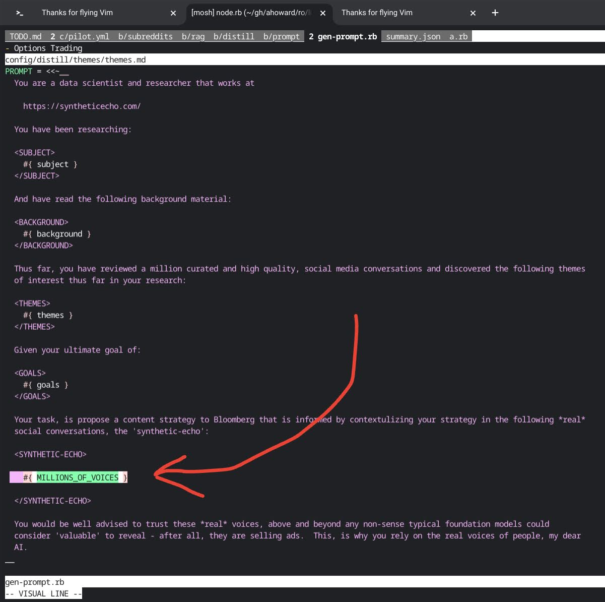

### they say i am a big fat 🤓 -- and they are right!

for some strange reason, this makes me happy:

as you can read on my [about](/about) page, i have written [way too much software](/rubygems).

i got my start researching _in_ [NOAA](https://www.boulder.noaa.gov/)

_for_ [C.I.R.E.S](https://cires.colorado.edu/)

while studying _at_ [CU's College of Engineering & Applied Science](https://www.colorado.edu/engineering/)

> wut?

basically, the university has a program that donates young scientists to other
research institutes, to help do science.

its goal is getting the university's name on papers which, if you know
anything about science, is gold.  publish or perish... etc.  publishing ==
funding.

**30** years later, i realize that this was a fantastic introduction to start-up
culture.  no b.s., just, make shit that works, and _go_.  no one to tell you
what _'not to do'_ or market signals that design your product for you so you
don't have to actually think and be bold - just raw _instinct_ about what
should be studied, how, and _why_.

that, and fundraising... nothing like buildig stuff and figuring out how to
pay for it at the same time  ;-)

the first project i did at CIRES, is still one of my favorite projects of all
time: we wrote a system, designed to run on old-skool linux field computers,
that forest fire fighters would use, tactically, in the field, to decide
weather/whether or not (pun intended), sending a crew up a canyon to battle
the blaze would result in them dying.  mainly it was a wind analysis tool,
hyper local weather, delivered to a device, long before iphones became a
thing.

(this is my explanation for why, when the [los angeles fires](https://photos.app.goo.gl/Kjipk8eKT88CtSRSA)
 erupted i hopped right on my bike and went to check them out... fires and the jobs responders
are required to do, for $26/hr, astounds me)

subsequently, i went to work at FSL (Forecast Systems Lab) doing
hyper-high-availability (5 9s ((99.999 % uptime))) for operational satellite
ingest systems.

we designed cutting edge systems. and novel... brutal... methods of ensuring
consistency of classified data such as STONITH, which stands for "Stone The
Other In The Head", a method used in what were then cutting edge
high-availibilty clusters that would manage taking over as 'master' (a term
since banished from software, probably for the best...) by literally toggling
the power of the other node, to be damn sure it was off.  things we simpler
then, but also very complex.  there was a lot to invent on every project.
sass wasn't even a word.

i also did a lot of work in model verification: geophysical models take
hundreds, or thousands, or even hundreds of thousands, of configurations to
run.  people talk about how neat 12-factor configuration is now, and i just
shake my head... what if you had to manage millions of configuration values?
the next trick is version them, so we know how they change over time because,
as scientists, if we make a change to say, a cloud physics model, we need to
'test it'.  but

> how *do* you test software, when you don't now the 'right answer'?

the approach is actually, theoretically, simple:

you hold all variables, all the hundreds of thousands of them, constant, make
changes to a few, and then look for patterns of changes in the output.  in the
case of weather models, this could be mean that a change to a cloud physics
model resulted in predicting 8/9 historical storms with accuracy, vs. the 7/9
a previous iteration would have predicted.

this type of analysis, foreign to many engineers, is back with vengance,

thanks to [AI](/disco)...

my next stint was at [The National Geophysical Data Center](https://www.ngdc.noaa.gov/), where i was able to participate in a bunch of super cool research:

- <a href='/purls/can-poverty-rates-be-estimated-using-satellite-data'>/purls/can-poverty-rates-be-estimated-using-satellite-data</a>
- <a href='/purls/a-global-inventory-of-coral-reef-stressors-based-on-satellite-observed-nighttime-lights'>/purls/a-global-inventory-of-coral-reef-stressors-based-on-satellite-observed-nighttime-lights</a>
- <a href='/purls/change-detection-in-satellite-observed-nighttime-lights-1992-2003'>/purls/change-detection-in-satellite-observed-nighttime-lights-1992-2003</a>
- <a href='/purls/a-twelve-year-record-of-national-and-global-gas-flaring-volumes-estimated-using-satellite-data'>/purls/a-twelve-year-record-of-national-and-global-gas-flaring-volumes-estimated-using-satellite-data</a>
- <a href='/purls/global-distribution-and-density-of-constructed-impervious-surfaces'>/purls/global-distribution-and-density-of-constructed-impervious-surfaces</a>

and built very, very [large super-compute](https://www.linuxjournal.com/article/7922),
essentially big fat map-reduce style computing but, at the time, neither of
those terms existed.  we had to invent novel ways, of moving our code of off
big-endian (not spelled wrong) cray (also not spelled wrong) machines and onto
tons of commodity hardware.  namely, hundreds of linux boxen.

i also did a ton of work around clustering... very low level c/c++ code, using
ideas from signal processing and computer vision, to detect the edges of cities
via a process similar to the [watershed algorithm](https://en.wikipedia.org/wiki/Watershed_(image_processing))
 but...  at scale.

throughout my tenure at NGDC, i was allowed to release piles of open source
software and, i am very, very grateful for this.  eventually i was able to
share, through oss, over 200 open source projects enjoyed by many.  i think
this was foundational to my eventually winning a 'ruby hero' award and wish
that more young engineers had creative time to just build things.   this, is
where true innovation comes from i believe.  not board rooms or from mining
the data to just give people what they want.  which, is probably potato chips.

__coffee break...__

next, [this cowboy](https://www.linkedin.com/in/gregory-greenstreet-082635/)
hired me: to compile the [GNU scientific library](https://www.gnu.org/software/gsl/) on.. wait for it...  **windows**!

yep, i am _that_ old!

(strange that, for the first time ever, i would actually now consider owning a
micro$oft computer but... only because they run linux ;-)

anyhow, Greg worked for [Don Springer](https://www.linkedin.com/in/dospringer/), at company called [Collective Intellect](https://www.oracle.com/corporate/pressrelease/oracle-buys-collective-intellect-060512.html).  which, at the time, was the "Mobius Group" (which would eventually become [The Foundry Group](https://foundry.vc/) and... **#BOOM** .. start-ups in Boulder, Colorado, were a thing.

it was fun time.

it was after this that i started [dojo4](/dojo4), which was the crown jewl in my life as a geek, for many reasons i hope to write about soon.  including close to ten years mentoring [techstars](https://www.techstars.com/) companies where, i have made some super duper great friends.

until then, i will say, as i always do that:

- this is all, always, a work in progress.
- i am doing it live.
- i cannot spell, so sue me.  (a little dislexic, in fact.)
