[tl;dr;](#tl;dr;)

> in april, 2024, myself, and 6 brave men attempted to cross the harding
> icefield.
>
> in celebration of [yule kilcher's 1968 crossing](https://en.wikipedia.org/wiki/Harding_Icefield#History)
>
> midway through our trip, at the point of no return, we were beseiged by a storm of storms.
>
> we dug shoulder to shoulder for 5 days before the air national gaurd crash
> landed, and we crawled into the void on a one way journey to save each other's
> lives at a bearing of 300, 900 meters away.
>
> these are my memories from that trip.
>
> they are not meant to be definiative or complete; merely a refelection on how
> the experience sits in my mind.
>
> it took me a full year to be able to put pen to paper about this so, forgive
> any tresspasses.
>
> it's strange how fungible time truly is.
>
> __a lifetime, a lifetime ago, just yesterday...__

[p.s.s](#pss) -> [@gaz](https://www.instagram.com/gazleah/) is [making a film about this ↓↓↓↓](https://www.wellgoodproductions.com/)

at this point, i was down to being able to remember

> hail mary, full of grace

and then nothing.

the rest of the verses eluded me.

as did my children's names.

everything, was very, very far away.

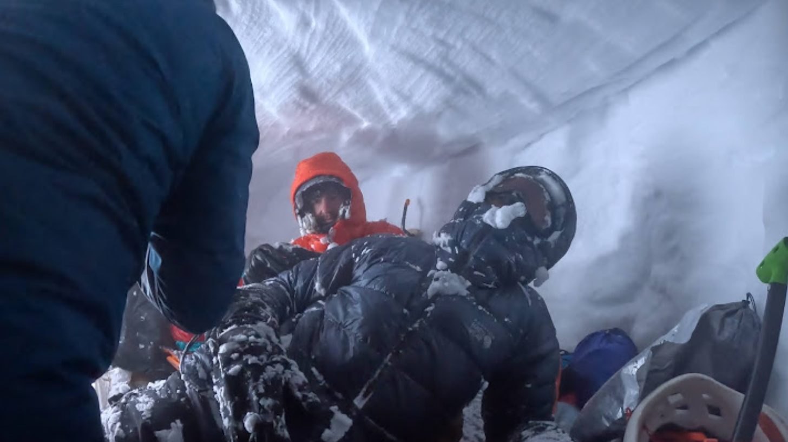

suddenly there was gaz, pulling me out of a 10 feet deep hole in the snow.

out of the darkness of the cave, into the pure white nothingness of the storm.
wind screaming like a banshee.  it was so white, so loud. it hurt.  after
nearly 5 days in that hole.

i imagine this might be what it's like to be born.

pulled from a dark place you cannot stay, into the brightness of a place you
will surely die in.

i was feeling slightly lackadaisical, not in a hurry, but i was still aware,
in some capacity, that gaz seemed to be yelling:

  **"go! go! go!"**

i was having difficulty being excited about it.

so. cold...

above ground, it was time for one last push.

not long before we'd made josh 'a last cup of coffee'.  he said it was the
best he'd ever tasted.  he seemed to be the last one standing.

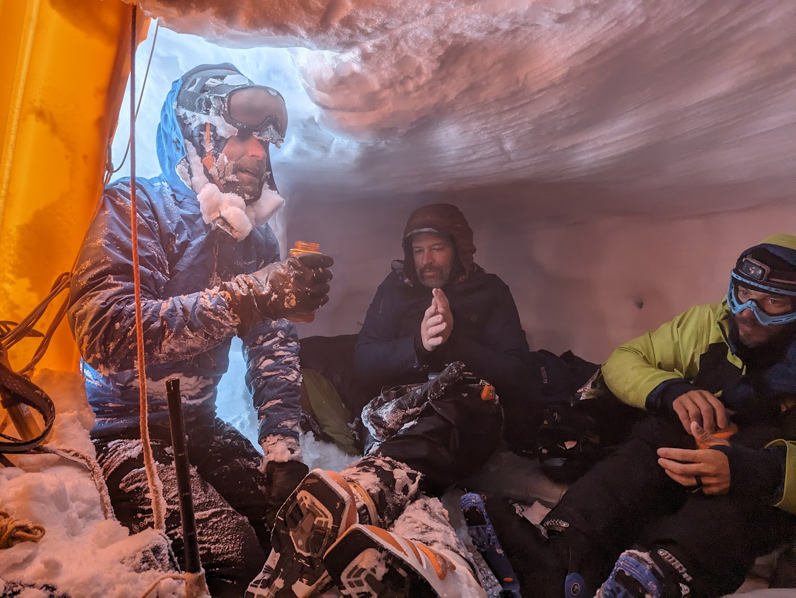

i think that was the point when we knew.

we couldn't keep up -- we were going to be buried alive.

they were not going to be able to reach us -- despite trying for days.

probably before the next morning or, depending on the rage of the storm, in
minutes.

we'd radioed the rescue team, letting know we were tapping out.  we didn't
want them trying to recover corpses.

one more shot!  the radio said.  they were going to try one more time...

at its peak, the storm pumped out snow like it was being blown out of a
firehose.

<iframe width="560" height="315" src="https://www.youtube.com/embed/7N4briDDD7A?si=xYSyzpdnKlMvQNgC" title="YouTube video player" frameborder="0" allow="accelerometer; autoplay; clipboard-write; encrypted-media; gyroscope; picture-in-picture; web-share" referrerpolicy="strict-origin-when-cross-origin" allowfullscreen></iframe>
 

some of us were lifelong alaskans.

we grew up mountain running, backpacking, winter camping in freakishly bad
weather.  i've read how to build a fire a hundred times.  as my dad taught me:
**3**, not 2 ways to make a fire.  unless you have a death wish.

of course, on a glacier there is no way to make a fire. nothing to burn.

gaz trained special ops people in winter travel and was a guide in france for
years. he is good at his job because he can film skiing switch.  he
knows how to fly paragliders, scuba, climb. and he split his skull open in
oman in a climbing fall. at that time, he was the only one of us to have been
rescued by a military helicopter.

he is also a bit of a nut.  i loved him 30 seconds after picking him up at
the anchorage airport:
 
 
[https://recorder.google.com/5ceeb9c2-22a7-47fe-a1e0-48654444fa1b](https://recorder.google.com/5ceeb9c2-22a7-47fe-a1e0-48654444fa1b).

josh lives in a 12x8x15 cabin, built into the roots of hemlock trees on
a steep hillside in seward, alaska. surrounded by moss and ice climbing. he
doesn't have electricity, or running water.

his days seem to be filled with a.m. radio, watching the weather, and looking at
maps.

he is always pointing.

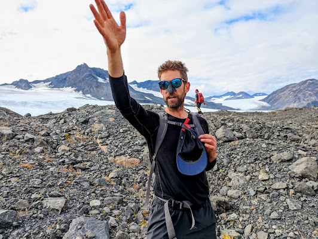

levi, who has the strength of the Incredible Hulk, the heart of Shrek, the
brain of Bernardo Kastrop and a gigantic Alaskan smile, had never seen it snow
like this.

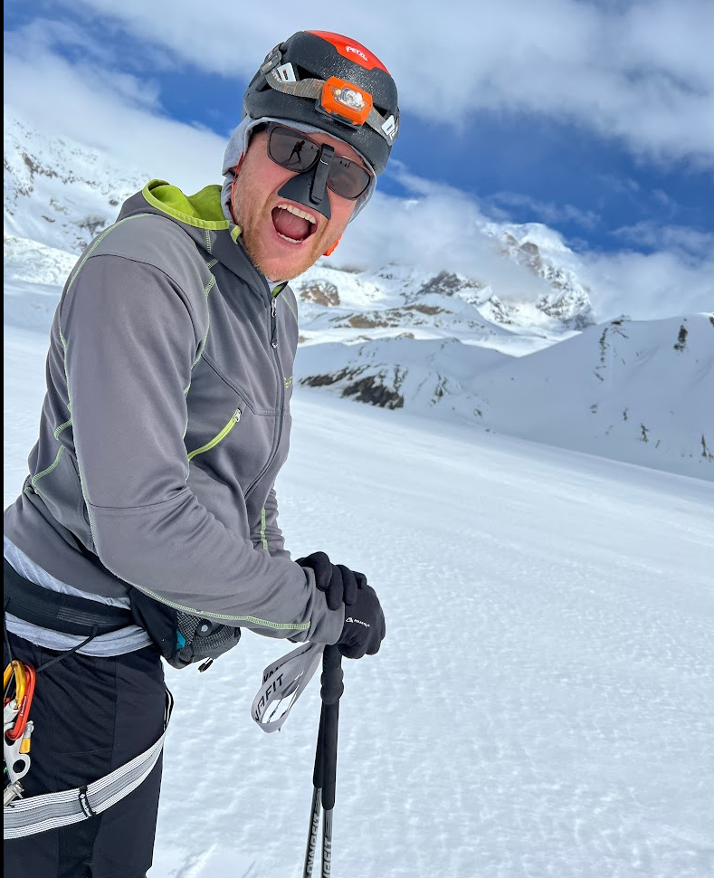

none of us had.

it came down in sheets.  a strange combination of graupelly pellets surrounded
by what seemed like grape sized slush balls surrounding them.

later, in the chunnel, it would fill up as fast as you could move it.  working
full tilt.  panting, wheezing, stumbling about with less than zero visibility.

shovel full tilt for 10 minutes.  turn around to feel everything you'd just
removed already returned.  racing for air.

while digging, i often simply left my eyes closed to conserve energy, and hold
onto to sanity.

at the bottom, under the awning of skis we’d barely managed to retrieve on a
recon mission, i would drop and take a knee.

to say another ‘hail mary’.

my grandma had told me, over and over and over again, that i would one day
need it.

she made me say it with her over and over.

but this was the first time i’d felt i truly needed it.

> axel, nova, axel, nova, axel...

my kids' names.

>
> outside of right leg. 
> __(axel)__ 
> towards right leg, swinging it out of the way. 
> __(nova)__ 
> between the legs. 
> __(axel)__ 
> towards the left leg swinging left foot out of way. 
> __(nova)__ 
> outside of left foot. 
> __(axel)__ 
>
> __[[ reverse ]]__
>
> towards left leg, swinging it out of the way. 
> __(nova)__ 
> between the legs. 
> __(axel)__ 
> towards the right leg swinging right foot out of way. 
> __(nova)__ 
> outside of left foot. 
> __(axel)__ 
>

digging truly was the best part. at least then, you were warm.

and above ground.  breathing air.

the chunnel had gotten so high and narrow only two men could work at a time.

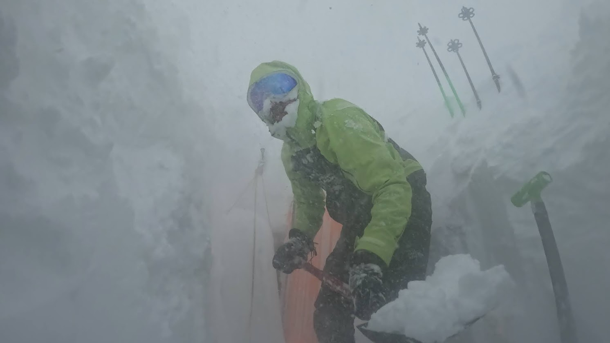

i kinda figured that randy would go first.  at night i'd felt him, hands and
knees, shivering...  but, the spring before, i'd seen him reveling in shit
like this...

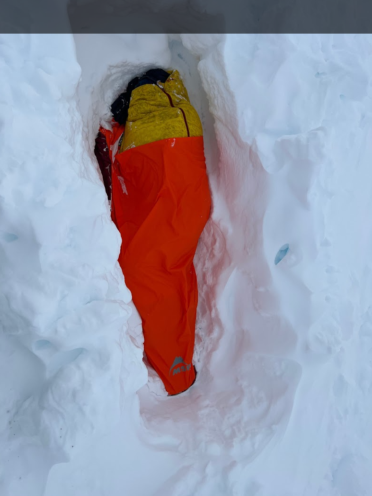

__maybe it would be ok?__

he never seemed to stop laughing.  even when he was hypothermic. for days.

<iframe width="560" height="315" src="https://www.youtube.com/embed/i8Se0WE77p4?si=DpOZCJZVI73P2gTK" title="YouTube video player" frameborder="0" allow="accelerometer; autoplay; clipboard-write; encrypted-media; gyroscope; picture-in-picture; web-share" referrerpolicy="strict-origin-when-cross-origin" allowfullscreen></iframe>
 

on day 2, or 3, or 4 - i forget, levi woke up in a panic, realizing that the
structure of our roof, the roof of our ‘backup backup backup’ cave, the one we
weren’t supposed to need, wasn’t convex enough and that our breath was slowly
melting it.

thousands of pounds of wet, dense, snow was above us, and starting to drip and fall out in clumps.

he stripped off his clothes and started chopping away at the ceiling. a sled
brigrade to shuttle the snow, raining down everywhere on our gear.

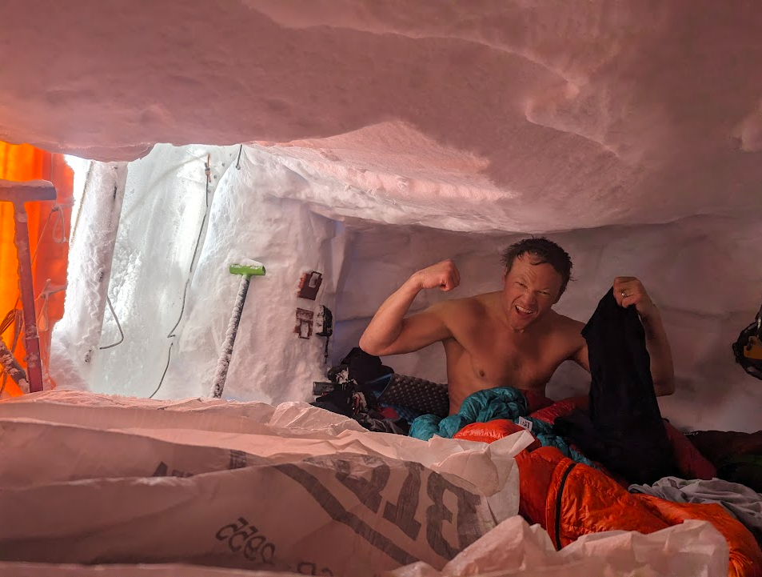

when everything is soaking wet and freezing, it can easily take two people and
30 to 45 minutes to simply execute a clothing change.  inside the cave, it's
34 degrees and raining.  the second you are outside, everything freezes solid.
once back inside, you get to reverse the process.

<iframe width="560" height="315" src="https://www.youtube.com/embed/z-L13WwsBkg?si=-S3ikF9CzF-VTYMR" title="YouTube video player" frameborder="0" allow="accelerometer; autoplay; clipboard-write; encrypted-media; gyroscope; picture-in-picture; web-share" referrerpolicy="strict-origin-when-cross-origin" allowfullscreen></iframe>
 

we used all our tricks.

i remember a particular session.

it was the first time i’d been able to perceive any atmospheric feature in
days.

not the moon, not sky, nor the massive bulk of the nunatak behind us.

i leaned inside and said:

> **i saw the moon!**

no one moved.  maybe they didn't hear me?

i went back outside to keep digging.

----

for levi and eivin, this trip was born onto them.  their grandfather yule was the first
explorer to cross the ice sheet in 1968.  still boggles the mind, knowing what
they did, back then, on that gear.

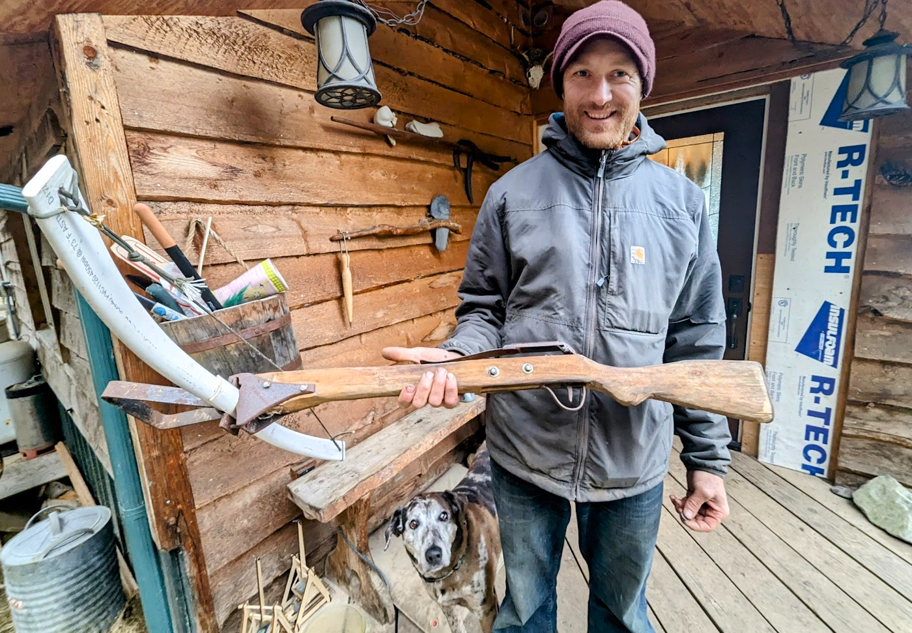

but for me, it was only 3 years in the making.

---

i’d met jess deep in the desert.  having gotten off crutches just a few weeks
before.

she sent me.  knowing before i did that i had to go.

----

then somehow she was there with me.  on the left side, in front.

directly opposite the dark energy of the nunatak which i could barely see.
could not see.  but could feel.

the juxtaposition felt a little like a lightning bolt, piercing diagonally
through my body but, at that moment, i knew i was ok to die.  i was seeing all
of it, right now, or so i still feel.

i think each of us felt it, in our own way.

the idea of lying next to your best friends, exhausted, and falling asleep in
total silence, buried together, seemed pretty ok.

sure the fuck beats dying of cancer surrounded by beeping monitors and strangers.
tv in the corner.  at least, from what i've seen.

that’s what i’d felt in **that session**.

----

a few days ago, levi left a voice message in our group chat.  almost one year
before the day.

he reminded us that mike had woken us all up.  and that this small act had saved our lives.

<iframe width="560" height="315" src="https://www.youtube.com/embed/5V-cYzmAQ58?si=ZbUk9Y9X9D7TVVsp" title="YouTube video player" frameborder="0" allow="accelerometer; autoplay; clipboard-write; encrypted-media; gyroscope; picture-in-picture; web-share" referrerpolicy="strict-origin-when-cross-origin" allowfullscreen></iframe>
 

there were 100s of such small acts over that week in the cave.

mike is missing a finger.  a fisherman.  father.  carpenter.

he built his own dome and gardens year round in a 20x40 hoop building in homer
alaska.  he’s built like an ox.

3 big ones: levi, josh, mike.  and 3 small ones.  ara, randy, gaz.

eivin is the smart one.  he left on day 4, via ski plane.  before anyone knew
what was up.   thankfully for us, because he and sarah held everything
together for us later.

i remeber mike reaching over the group to scratch my head when it was getting
hard, face crushed into the ice wall.  randy shaking violently in between
levi, and me.

our sleeping bags were completely useless. only this tyvek bivy created enough
warm, dry space to raise body temperature.

levi and i have talked about next time.  no sleeping bags.  wool.  perhaps
sealskin.  and sails, definitely bringing sails for the skis.  a sealskin sail
would be very useful, and better in an ice cave than even tyvek.

stuff made out of oil starts to feel just like what it is in situations like
this.

plastic.

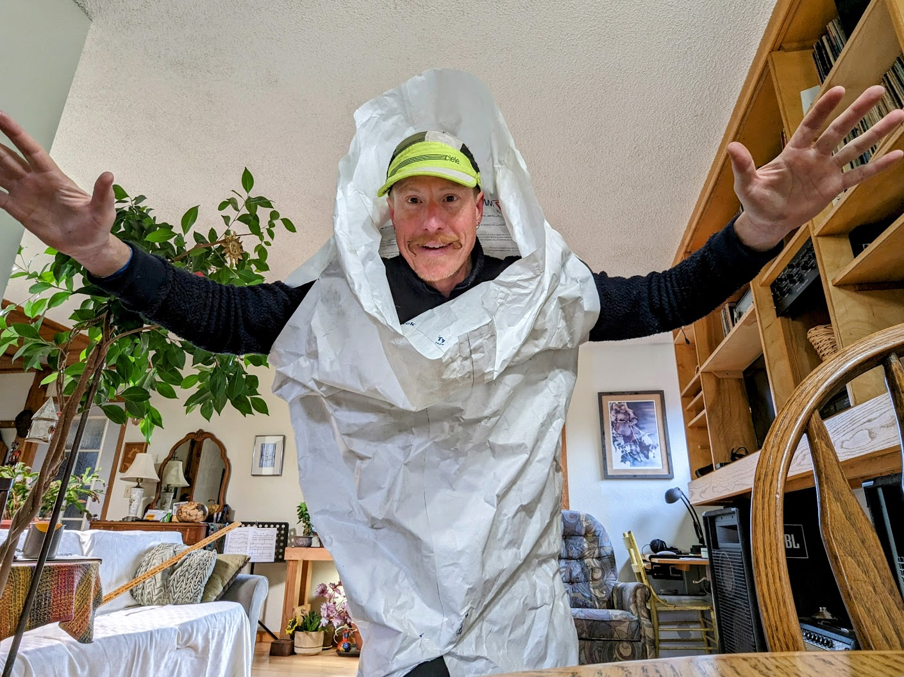

these are the kinds of things only ‘alaska boys’ seem to appreciate.   you can
tell them in any group of moutaineers - all thier shit is either 30 years old,
homemade, or a piece of carbon a buddy just started manufacturing out of his
bus.

well, that, and some ozzy osbourne.

mike also woke up screaming at one point - singing

> [‘going off the rails in an icey c-avE! 🎵🤘🤘🤘’](https://open.spotify.com/track/7ACxUo21jtTHzy7ZEV56vU?si=f77d78dc3ea24ad2)

around 3 in the morning on night 3.

despite being too tired to laugh, it was at least as comforting to me as
praying.

on the helicopter i messaged jess. telling her that i’d felt her there, when i
as utterly alone, and that i loved her.

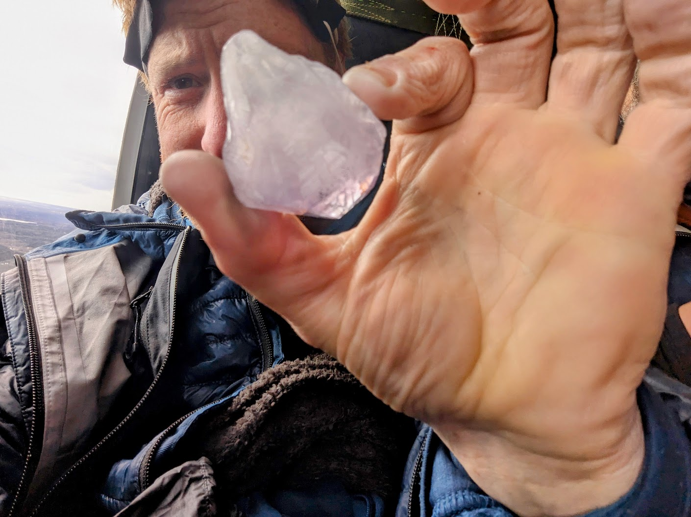

i didn’t yet know that she’d tracked down sarah, josh’s sister, and known of
the severity of our predicament for the past few days, during which she’d also
been up all night praying.

for all of us.

who does that?  there is a reason i've been in los angeles for a year now.
some gennies don't go back in the bottle.

sarah had been instrumental in our rescue.

along with eivin, and many other friends and family members, calling everyone
from the national guard to friends with crazy ideas about how to approach us
on tracked vehicles after the storm passed.

we had hit the button on day two.

it took many approaches, and two more nights, before we saw that red coat in
the distance.  literally the happiest any of us have probably been to see
another human being.

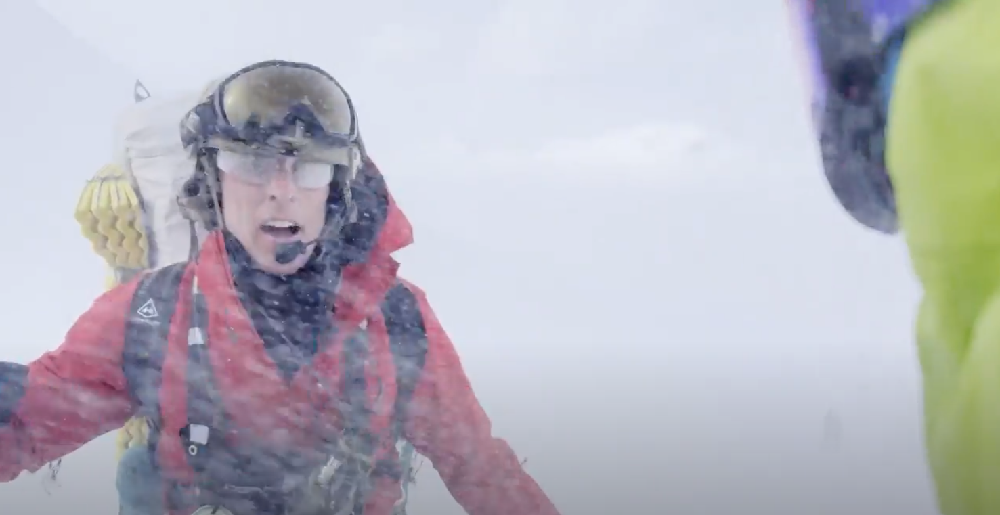

at the hospital, walking through the hallways, the staff and
patients literally gagged and moved away quickly.

we smelled like death.

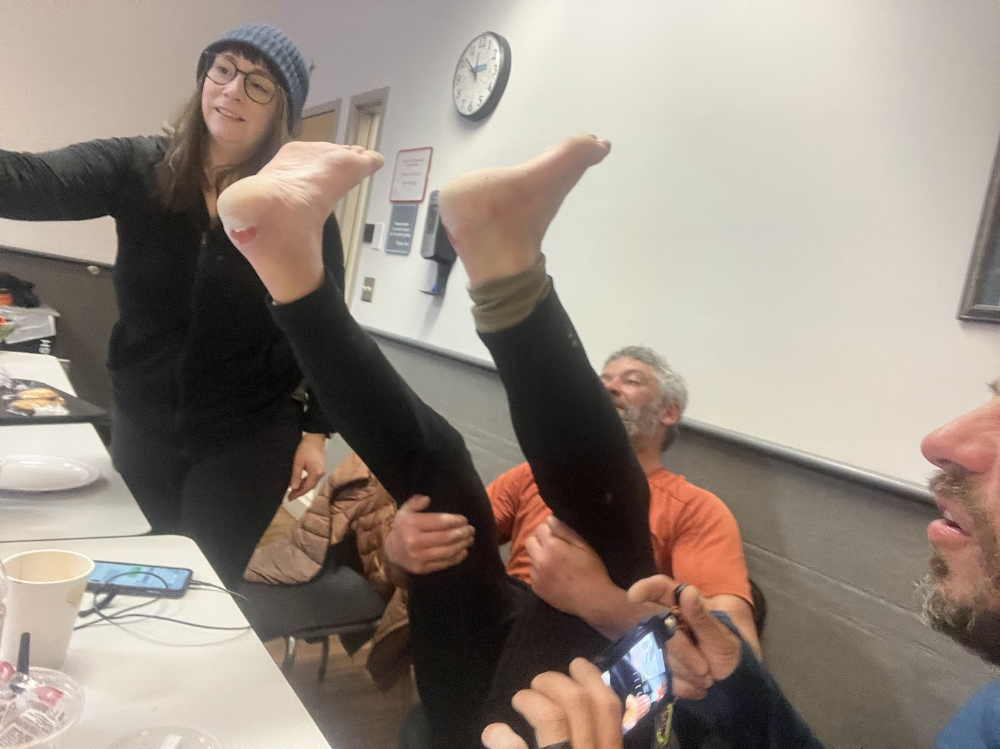

sarah took us to fred meyer to buy new clothes.  most of my clothing still
smells like cave. even after washing it in bleach.

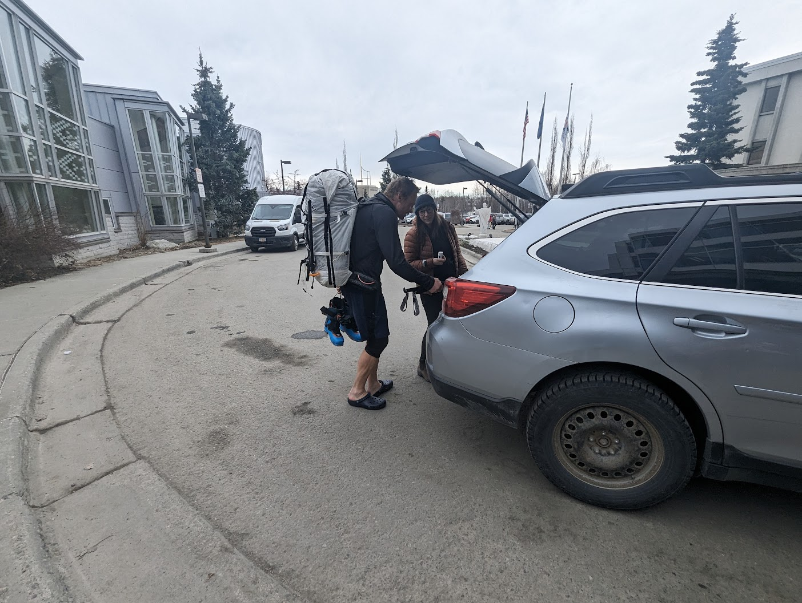

at freddy's i wandered around remembering being a kid:  grandma always took me
there too, and we'd visit my uncle rik, that ran the store.

we lost mike for then second time in 24 hours.  though thankfully not in a
crevasse -- it was in the meat isle.

the only thing i recall eating in the cave was a handful of moose jerky that
mike stuffed in my mouth as i crawled out for another shift.

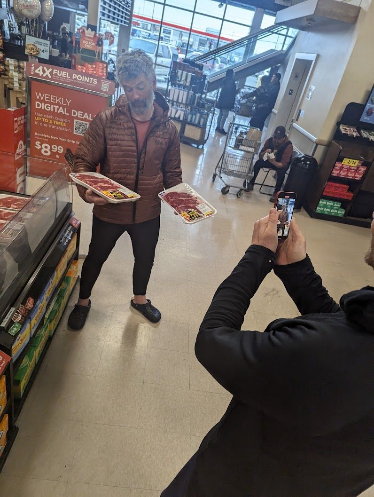

back in anchorage, bellies full, and in dry clothes, we let our guards down.

so. happy.

being upright, and above ground.

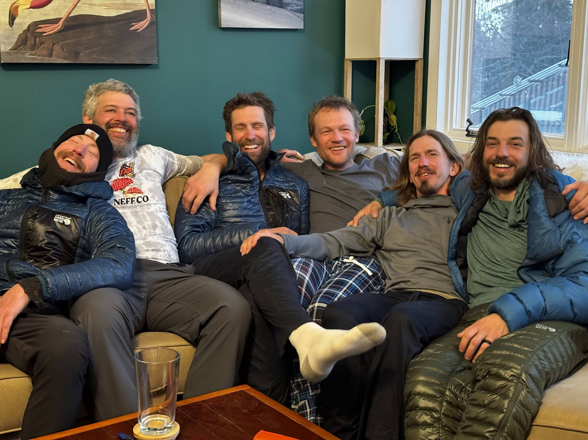

and fell asleep

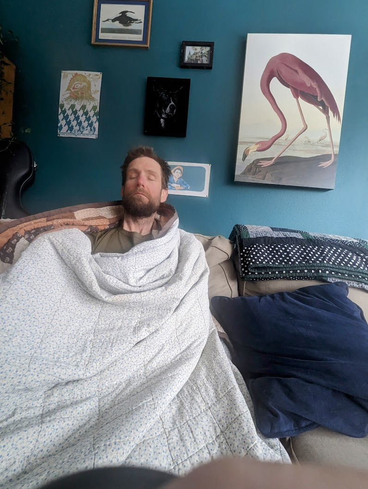

there are so many other things i coudl say about this trip.

and re-reading now, i can see clearly that, despite a year of trying, i will
never be able to explain what happened out there.

but, today, april 19th, 2025, one year to the day that we were rescued, i
wanted to stop to say thank you to my friends, thank you to my family, thank
you jess.

thank you axel and nova.

i wouldn't be here without you.

so much love to you all.

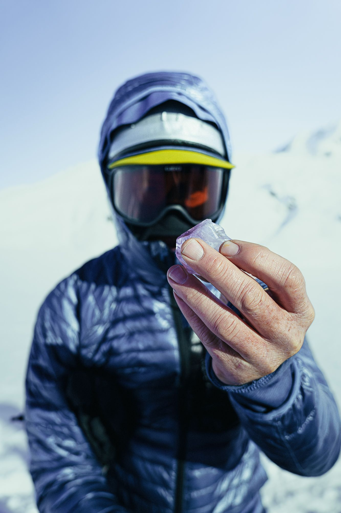

---
[more photos =>](https://photos.app.goo.gl/xbRt9Waj8583Bzvd7).
