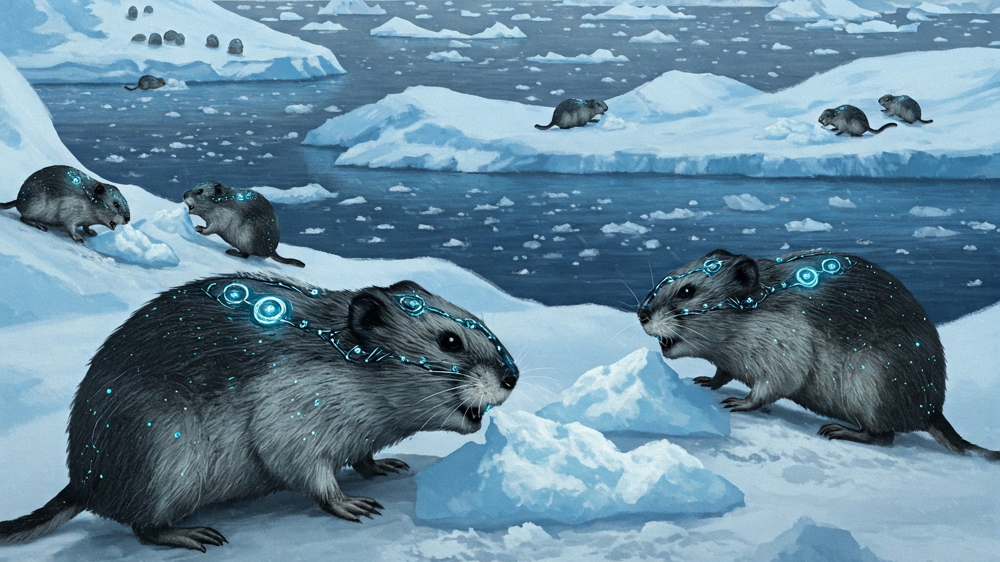

##### the rise and fall of the lemmings

in the heart of the tundra, a forgotten corner of the world, a small colony of lemmings thrived. these furry creatures, with their insatiable appetite for grass and their unwavering determination to reproduce, had long been a part of the delicate ecosystem. however, a series of fortunate events, or perhaps unfortunate coincidences, led to an unprecedented boom in their population.

the lemmings, once a modest presence, began to multiply at an alarming rate.
their numbers swelled, their burrows multiplied, and their insatiable hunger
for grass depleted the once-abundant fields. the other creatures of the
tundra, the foxes, the owls, and the hares, watched in growing alarm as
their food sources dwindled. the foxes and owls, simply outnumbered, were
unable to compete with the overwhelming numbers of lemmings and the hares
simply could not find enough food.

the lemmings, oblivious to the plight of their fellow inhabitants, continued their relentless pursuit of reproduction. their population grew exponentially, their tunnels crisscrossing the landscape like a network of subterranean highways. the once-verdant tundra began to show signs of strain, the grass patches turning brown and barren.

the hares, once the dominant herbivores of the tundra, were now forced to compete with the insatiable lemmings for the dwindling food supply. their numbers dwindled, their once-proud herds reduced to scattered individuals.

the lemmings, however, remained unconcerned. their focus remained firmly on reproduction, their tunnels expanding further, their hunger growing more insatiable. the tundra, once a vibrant ecosystem, was now a desolate wasteland, a victim of the lemmings' unchecked growth.

as the food supply dwindled, the lemmings began to turn on each other. fights erupted over scraps of grass, burrows were invaded, and the once-united colony fractured into warring factions. disease, a consequence of overcrowding and malnutrition, spread through the weakened population.

amidst the chaos, a small group of lemmings emerged, driven by a sense of compassion and a desire to save their kind.

---

**these enlightened lemmings, known as the "reformers," sought to address the issues of overpopulation, disease, and infighting.**

---

the reformers, armed with a deep understanding of their society, implemented a series of reforms aimed at improving living conditions and promoting harmony. they established communal granaries to ensure fair distribution of food, constructed improved burrows to prevent disease outbreaks, and promoted peaceful coexistence among the different factions.

the reformers' efforts yielded positive results. the death rate decreased, the incidence of disease declined, and the overall quality of life for the lemmings improved. however, the underlying problems of overpopulation and resource depletion remained unresolved.

the reformers, blinded by their focus on short-term gains, failed to recognize the long-term consequences of their actions. their interventions, while seemingly beneficial, only served to prolong the inevitable collapse of the lemming population.

as the tundra's carrying capacity was exceeded, the lemmings' numbers continued to rise, their impact on the ecosystem intensifying. the once-vibrant ecosystem, now dominated by the lemmings, could no longer sustain life. the foxes, the owls, and the hares, unable to compete with the overwhelming numbers of lemmings, perished.

the lemmings, once a vital part of the tundra's ecosystem, had become its destroyers. their unchecked growth, fueled by a relentless pursuit of reproduction, had led to the demise of their own kind and the destruction of their habitat.

> frozen tundra lies 
> lemmings' ghostly shadows dance  
> nature's balance lost
