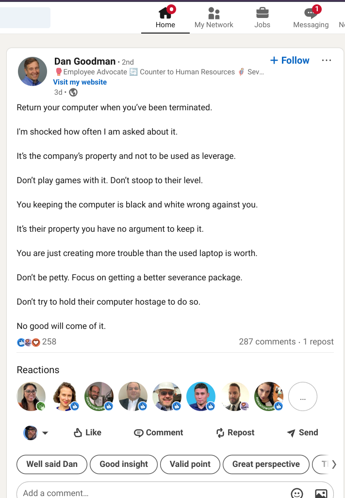

following is an AI generated summary of this article, so you won't have to read it!

> ### "
> A user on LinkedIn suggested that terminated employees should **always**
> return thier laptops, and that issue was cut and dried.
>
> [disco](/disco), a tool for bringing real human subjectivity to AI was then
> used to examine public sentiment about this statement.
>
> The responses varied, with some people feeling that employees should keep the
> laptops as a small consolation or to help with job searching, while others felt
> that keeping company property was unethical or a security risk.
>
> Some people suggested that companies offer a buyout option for the laptops,
> while others felt that a clean break was best.
>
> The responses highlight the complex and multifaceted nature of the issue, with
> no easy answers or universal agreement.
> ### "

i recently saw this unsolicited and undirected "suggestion" on linked-in (home
of the weak sauce), suggesting that the **only** ethical move is to return your
laptop when you've been fired.

while i do not condone brazen theft or just being a jerk, i personally
considered this post astonishingly tone deaf, in light of the fear so many who
have recently been laid off are feeling.  for many, a computer, and the
internet, are their only lifelines to a potential future.

this situation is one i have experienced personally.  i've been laid off, a
few years back, and went through a very, very difficult period (still to some
degree) where getting a job was a strangely recursive scenario - that is to
say, i needed money to buy a computer capable enough, to keep up with the
times, to stay sharp, to get a job.  this is a real phenomenon experienced by
many.  a nice laptop for a developer costs a cool $4k.

dan seemed pretty sure of himself so, i decided to run his theory through my
new thing, which i am calling [disco](/disco).  as you can read for yourself,
i think the issue is more nuanced than he suggests, and that, in this period
of history, considering the massive ill will the general public is
snowballing, and getting ready to toss at corporations, it's worth seeing what
others might think.  fwiw, [disco](/disco) lets you ask any question, and then
get back answers that are informed by real human beings, at scale.

it's my little attempt to use their weapons against them.

take some time, to review [these results](https://gist.github.com/ahoward/9696f63c118f7b9f102b04e5b4196ca5)

[what do you think?](/contact)

ps.  in a future post, i'll show you how you can do way, way, way better with
your development environment by ditching apple, microsoft, etc.  and moving to
linux and a chromebook.  my current dev box costs me $320 at best buy and i'm
more productive than ever.

